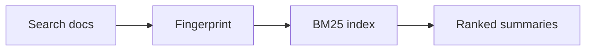
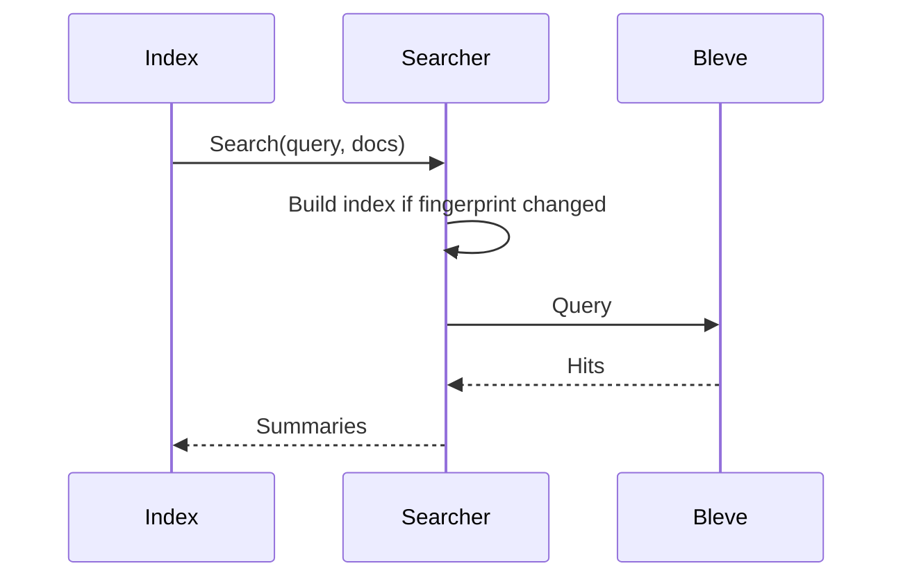

# Architecture

`toolsearch` is a pluggable search strategy for `toolindex`.

## Indexing flow

## Search sequence

## Determinism

- Docs are sorted by ID before indexing
- Tie-breaking uses score DESC, then ID ASC
- Fingerprints ensure stable caching
