# User Journey

This journey shows how `toolsearch` slots into the end-to-end workflow as a pluggable search engine.

## End-to-end flow (stack view)

```mermaid
%%{init: {'theme': 'base', 'themeVariables': {'primaryColor': '#d69e2e', 'primaryTextColor': '#fff'}}}%%
flowchart TB
    subgraph config["Configuration"]
        Env["🔧 Environment Variables"]
        Strategy["METATOOLS_SEARCH_STRATEGY=bm25"]
        Boosts["Field Boosts:<br/><small>name: 4x, namespace: 2x, tags: 1x</small>"]
    end

    subgraph index["toolindex"]
        Docs["📄 SearchDoc[]<br/><small>ID, Name, Namespace,<br/>Description, Tags</small>"]
    end

    subgraph searcher["toolsearch.BM25Searcher"]
        BM["🔍 BM25 Algorithm"]
        Bleve["📊 Bleve Index<br/><small>auto-rebuild on change</small>"]
        Score["🏆 Score + Rank"]
    end

    subgraph output["Results"]
        Results["📋 Summary[]<br/><small>deterministic ordering</small>"]
    end

    Env --> Strategy --> Boosts
    Boosts --> BM
    Docs --> Bleve --> BM --> Score --> Results

    style config fill:#718096,stroke:#4a5568
    style index fill:#3182ce,stroke:#2c5282
    style searcher fill:#d69e2e,stroke:#b7791f,stroke-width:2px
    style output fill:#38a169,stroke:#276749
```




### Search Strategy Interface

```mermaid
%%{init: {'theme': 'base', 'themeVariables': {'primaryColor': '#3182ce'}}}%%
flowchart LR
    subgraph interface["Searcher Interface"]
        Search["Search(docs, query, limit)"]
    end

    subgraph implementations["Implementations"]
        Lexical["📝 Lexical<br/><small>simple substring</small>"]
        BM25["🔍 BM25<br/><small>TF-IDF ranking</small>"]
        Semantic["🧠 Semantic<br/><small>vector similarity</small>"]
    end

    subgraph index["toolindex"]
        Plug["🔌 Pluggable<br/><small>WithSearcher()</small>"]
    end

    interface --> Lexical
    interface --> BM25
    interface --> Semantic

    Lexical --> Plug
    BM25 --> Plug
    Semantic --> Plug

    style interface fill:#3182ce,stroke:#2c5282
    style implementations fill:#d69e2e,stroke:#b7791f
    style index fill:#38a169,stroke:#276749
```



## Step-by-step

1. **Enable BM25** in `metatools-mcp` using the `toolsearch` build tag.
2. **Set env vars** (e.g., `METATOOLS_SEARCH_STRATEGY=bm25`).
3. **Search requests** now flow through the BM25 searcher.

## Example: configure BM25 via env

```bash
# build with toolsearch support
GOFLAGS="-tags=toolsearch" go build ./cmd/metatools

# choose BM25 strategy at runtime
export METATOOLS_SEARCH_STRATEGY=bm25
export METATOOLS_SEARCH_BM25_NAME_BOOST=4
export METATOOLS_SEARCH_BM25_TAGS_BOOST=2
```

## Expected outcomes

- Higher-quality lexical ranking for tool discovery.
- Deterministic ordering and tie-breaking.
- No API changes required in `toolindex` or `metatools-mcp`.

## Common failure modes

- Build without the `toolsearch` tag and request `bm25` strategy (fails fast).
- Oversized tool descriptions if `MaxDocTextLen` is not capped.
